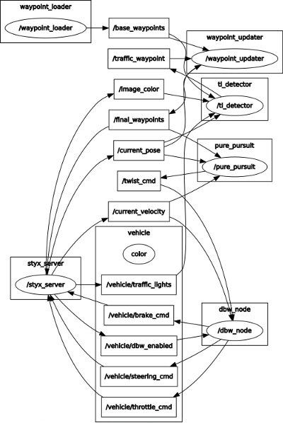
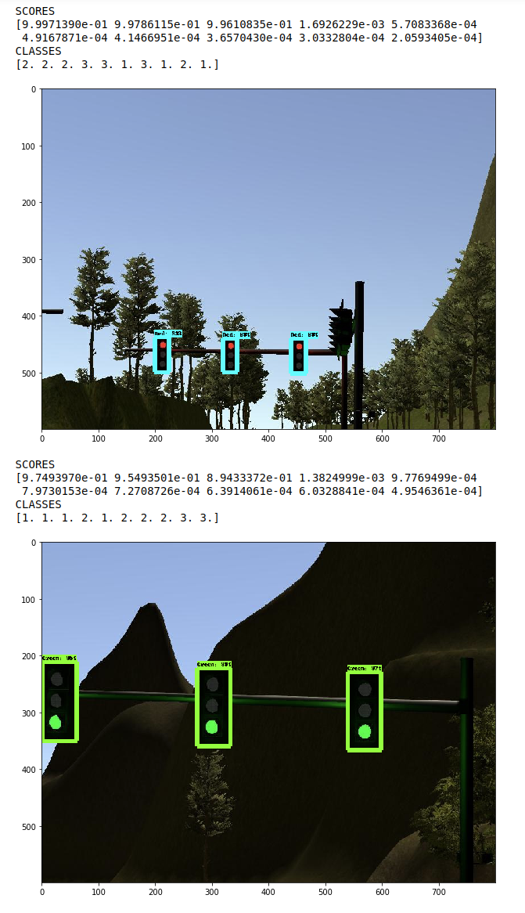
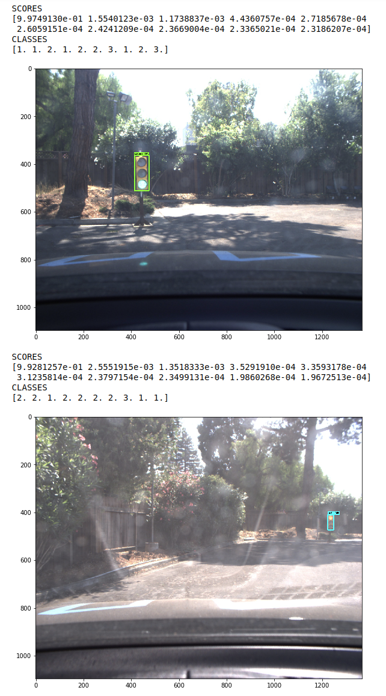

# Udacity Self-Driving Car Nanodegree: system integration

[](http://www.udacity.com/drive)

Team **CarlaAI** Members 
---


* [Hao Yin](https://github.com/williamhyin) (williamhyin@outlook.com)
* [Srivalli Boddupalli](https://github.com/bsrivalli3012) (bodsrivalli12@ufl.edu)

This is the project repository for the final project of the Udacity Self-Driving Car Nanodegree: Programming a Real Self-Driving Car.


## Table of Contents
- [Overview](#Overview)
- [ROS Nodes](#ROS-Nodes)
- [Traffic Light Detection](#Traffic-Light-Detection)
- [Waypoint Updater](#Waypoint-Updater)
- [Drive by Wire Controller](#Drive-by-Wire-Controller)
- [Getting Started](#Getting-Started)
- [Native Installation](#Native-Installation)
- [Docker Installation](#Docker-Installation)
- [Usage](#Usage)
- [Real word testing](#Real world testing)

Overview
---
This repository contains the code for the final project of the [Udacity Self-Driving Car Nanodegree](https://www.udacity.com/course/self-driving-car-engineer-nanodegree--nd013): Programming a Real Self-Driving Car developed by the team **CarlaAI**.

Carla's system consists of a set of components implemented and deployed as [ROS](http://www.ros.org/) node and can be broken down into 3 main  sub-system:  ***Perception***, ***Planning*** and  ***Control***:


System Architecture

Since Udacity already provides the basic execution framework, our team decided to focus on the implementation and integration of the following 3 nodes:

* [Traffic Light Detection](#traffic-light-detection): Part of the *perception* sub-system,  the node is responsible for detecting traffic lights as well as classifying their state.

* [Waypoint Updater](#waypoint-updater): Part of the *planning* sub-system, the node is responsible for generating trajectories (as a set of path points with their respective target speeds) considering the detected  traffic lights in the environment.

* [Drive by Wire Controller](#drive-by-wire-controller): Part of the *control* sub-system,  the node is responsible for translating the [Twist Messages](https://docs.ros.org/api/geometry_msgs/html/msg/Twist.html) generated by the [waypoint follower](./ros/src/waypoint_follower) into throttle, brake and steering values.

ROS Nodes
---


ROS nodes


### [Traffic Light Detection](https://github.com/williamhyin/Udacity-Traffic-Light-Classification)

The [traffic light detection node](./ros/src/tl_detector) is in charge of  detecting incoming traffic lights and classifying their state.  If the status of an upcoming traffic light is classified as a red light, the detector calculates and publishes its position (waypoint index), so that the [waypoint updater](#waypoint-updater) can take the position of upcoming red light in generating a trajectory (accelerate, keep speed, slow down).

The node subscribes to 3-4 topics:

* **/base_waypoints:** The topic publishes the complete list of waypoints for the course. 
* **/current_pose:** The topic publishes the current position of the vehicle.
* **/image_color:** The topic publishes the RGB image stream from the car's camera. These images are used to determine the color of upcoming traffic lights.
* **/vehicle/traffic_lights:** The topic publishes the (x, y, z) coordinates of all traffic lights. (only in simulator).


Traffic light detection node

In our project, the [detector](./ros/src/tl_detector/light_classification/tl_classifier.py) uses [Tensorflow](https://tensorflow.org) to run a variant of a [Single Shot MultiBox Detector](https://arxiv.org/abs/1512.02325) that uses as feature extractor [InceptionV2](https://arxiv.org/abs/1512.00567). The model weights used by the included graph are pre-trained on the [COCO Dataset](http://cocodataset.org) that already contains the traffic light category and provided by the [Tensorflow Object Detection API](https://github.com/tensorflow/models/blob/master/research/object_detection).

In this model, three different classes (GREEN, YELLOW, RED) are  *fine-tuned*  for different states of traffic signals, and the target detection, positioning and classification are folded into a single **end-to-end model** .

The model was fine-tuned for the task at end using labelled images from various sources, including the [Udacity Simulator](https://github.com/udacity/CarND-Capstone/releases), the [Udacity Training Bag](https://s3-us-west-1.amazonaws.com/udacity-selfdrivingcar/traffic_light_bag_file.zip) and images captured by Carla from real runs at the test lot of Udacity (Download [here](https://drive.google.com/file/d/0B2_h37bMVw3iYkdJTlRSUlJIamM/view?usp=sharing)). Note that we have developed 2 different models for both the simulator and Carla scenarios to accurately and robustly identify virtual and real traffic lights.

The images used for training were labelled and validated using [LabelImg](https://github.com/tzutalin/labelImg). The final dataset used for both training, validation and testing can be downloaded from [here](https://drive.google.com/file/d/1Pbo80uGf_LiZU7n-uY_Tpz-6fZtQX4ZZ/view?usp=sharing). We can use `create_tf_record.py` to split data into training and validation parts.

Considering the balance of model's accuracy and precision, we just use a signal pre-trained model (ssd_inception_v2) to fine tune and test, for more details about the whole process and the evaluation results see the dedicated [Traffic Light Classification Repository](https://github.com/williamhyin/CarNd-Traffic-Light-Classification).

*Note: Classification is only performed when the vehicle current location is between 0 and 75 waypoints from the traffic light stopline.  In order to realize traffic light detection in  both simulator and Carla, you need use different classification models for the Simulator and Site. The `self.config` dictionary found in the `TLDetector` class of `tl_detector.py` contains an is_site boolean. You can use this boolean to load a different classification model depending on the context.




The results of traffic light detection in simulator and Carla.

| Classes | Traffic light |
| ------- | :------------ |
| 1       | Green         |
| 2       | Red           |
| 3       | Yellow        |


### Waypoint Updater

The waypoint updater node is responsible for generating a trajectory in terms of waypoints so that the [waypoint follower](./ros/src/waypoint_follower) can generate the correct [Twist Messages](https://docs.ros.org/api/geometry_msgs/html/msg/Twist.html) consumed by the [DBW Node](./ros/src/twist_controller/dbw_node.py). Each of the waypoints are generated from a subset of the overall set of waypoints provided according to the vehicle position (published in the `/current_pose` topic). For each waypoint a target velocity is generated to smoothen the transition between each waypoint.

The node also subscribes to the `/traffic_waypoint` topic published by the [Traffic Light Detection Node](#Traffic Light Detection) in order to adjust the waypoints in the presence of a red light:

Finally the node publishes the list of waypoints ahead of the vehicle to the `/final_waypoints` topic.


Waypoint_updater node

### Drive by Wire Controller

Udacity's self-driving car Carla is equipped with a drive-by-wire (DBW) system, which controls the throttle, brake, and steering electronically.

The goal for this part of the project is to implement the drive-by-wire node (`dbw_node.py`) which will subscribe to `/twist_cmd` and use various controllers to provide appropriate throttle, brake, and steering commands. The node subscribes to the `/current_velocity` topic along with the `/twist_cmd` topic to receive target linear and angular velocities (generated by the waypoint follower node from the waypoints published by the [waypoint updater](#waypoints-updater). The [DBW node](./ros/src/twist_controller/dbw_node.py) primarily defines the communication interface.  This node publishes throttle, brake, and steering commands to the `/vehicle/throttle_cmd`, `/vehicle/brake_cmd`, and `/vehicle/steering_cmd topics`.  The [twist_controller](./ros/src/twist_controller/twist_controller.py) contains the algorithms used to generate the control values.


DBW Controller node

The longitudinal control (throttle/brake) relies on the speed target generated by the waypoint updater node.  A [low pass filter](./ros/src/twist_controller/lowpass.py) is used to remove high-frequency noise from the measured vehicle velocity.  Separate PID controllers generate the throttle and steering commands (in [twist_controller](./ros/src/twist_controller/twist_controller.py)), using different gains summarized in the Table below:

|          | P   | I   | D   |
| -------- |-----|-----|-----|
| Throttle | 0.3| 0.1| 0.0 |
| Steering    | 0.5 | 0.0 | 0.02 |

Computing CTE value of steering for PID in `dbw_node.py`  is necessary.

Getting Started
---

Please use **one** of the two installation options, either native **or** docker installation.

### Native Installation

* Be sure that your workstation is running Ubuntu 16.04 Xenial Xerus or Ubuntu 14.04 Trusty Tahir. [Ubuntu downloads can be found here](https://www.ubuntu.com/download/desktop).

* If using a Virtual Machine to install Ubuntu, use the following configuration as minimum:
  * 2 CPU
  * 2 GB system memory
  * 25 GB of free hard drive space

  The Udacity provided virtual machine has ROS and Dataspeed DBW already installed, so you can skip the next two steps if you are using this.

* Follow these instructions to install ROS
  * [ROS Kinetic](http://wiki.ros.org/kinetic/Installation/Ubuntu) if you have Ubuntu 16.04.
  * [ROS Indigo](http://wiki.ros.org/indigo/Installation/Ubuntu) if you have Ubuntu 14.04.
  
* [Dataspeed DBW](https://bitbucket.org/DataspeedInc/dbw_mkz_ros)
  
  * Use this option to install the SDK on a workstation that already has ROS installed: [One Line SDK Install (binary)](https://bitbucket.org/DataspeedInc/dbw_mkz_ros/src/81e63fcc335d7b64139d7482017d6a97b405e250/ROS_SETUP.md?fileviewer=file-view-default)
  
* Download the [Udacity Simulator](https://github.com/udacity/CarND-Capstone/releases).

  *Note: Ubuntu 18.04 TLS is also suitable for this project, the step is same as Ubuntu 16.04. 

### Docker Installation
[Install Docker](https://docs.docker.com/engine/installation/)

Build the docker container
```bash
docker build . -t capstone
```

Run the docker file
```bash
docker run -p 4567:4567 -v $PWD:/capstone -v /tmp/log:/root/.ros/ --rm -it capstone
```

### Port Forwarding
To set up port forwarding, please refer to the "uWebSocketIO Starter Guide" found in the classroom (see Extended Kalman Filter Project lesson).

### Usage

1. Clone the project repository
```bash
git clone https://github.com/udacity/CarND-Capstone.git
```

2. Install python dependencies
```bash
cd CarND-Capstone
pip install -r requirements.txt
```
3. Make and run styx
```bash
cd ros
catkin_make
source devel/setup.sh
roslaunch launch/styx.launch
```
4. Run the simulator

### Real world testing
1. Download [training bag](https://s3-us-west-1.amazonaws.com/udacity-selfdrivingcar/traffic_light_bag_file.zip) that was recorded on the Udacity self-driving car.
2. Unzip the file
```bash
unzip traffic_light_bag_file.zip
```
3. Play the bag file
```bash
roscore
rosbag play -l traffic_light_bag_file/traffic_light_training.bag
```
4. Launch your project in site mode
```bash
cd CarND-Capstone/ros
roslaunch launch/site.launch
```
5. Confirm that traffic light detection works on real life images

### Other library/driver information
Outside of `requirements.txt`, here is information on other driver/library versions used in the simulator and Carla:

Specific to these libraries, the simulator grader and Carla use the following:

|        | Simulator | Carla  |
| :-----------: |:-------------:| :-----:|
| Nvidia driver | 384.130 | 384.130 |
| CUDA | 8.0.61 | 8.0.61 |
| cuDNN | 6.0.21 | 6.0.21 |
| TensorRT | N/A | N/A |
| OpenCV | 3.2.0-dev | 2.4.8 |
| OpenMP | N/A | N/A |

We are working on a fix to line up the OpenCV versions between the two.

# Udacity-CarND-capstone-CarlaAI
